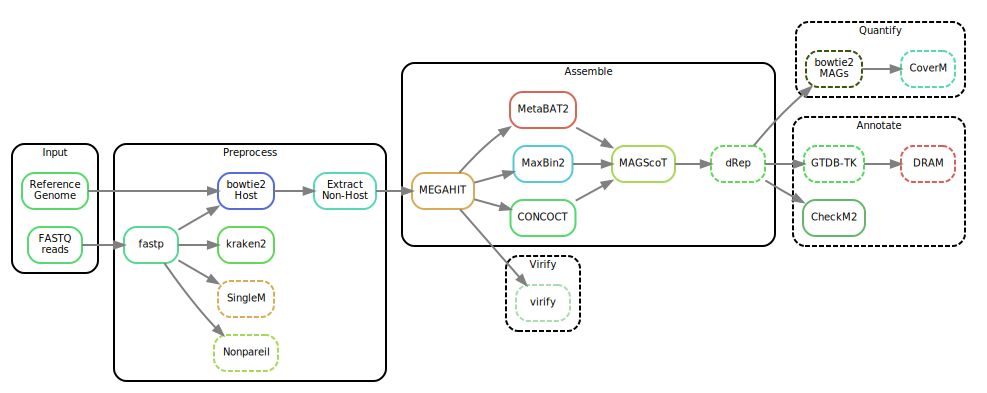

This pipeline is a fork from the Snakemake workflow

https://github.com/3d-omics/mg_assembly/

and tailored to the needs of the Holoruminant project.

Requirements:
Snakemake > 8.x

Supports:
SLURM executor / local execution
conda environment
docker/singularity/apptainer support

Fileformats:
It is assumed that host genomes, that are used for decontamination, are gzipped.

# Installation
You can install the pipeline by cloning this repository

The recommended setup is to have a separated pipeline folder (the cloned repository), that
carries the functionality and that must not changed by the user.

Then the project should have somewhere an own folder and a few configuration files are copied
to it. These are mainly

```
pipelineFolder="/some/path"
projectFolder="/some/other/path"
cd $pipelineFolder
cp -r config $projectFolder/
cp -r resources $projectFolder/
cp -r workflow $projectFolder/
cp -r run_Pipeline-Holoruminent-meta.sh $projectFolder/
```

TODO: THE WORKFLOW ONLY CONTAINS PATHS TO HMM FILES; THAT COULD BE ALSO GENERALISED!

Before starting, a few configuration files need to be added.

## run_Pipeline-Holoruminent-meta.sh
...

## config/config.yaml
...

## config/profiles/
...

## config/features.yaml
...

## config/params.yaml
...

## config/samples.ysv
...

# Usage
The pipeline can run the entire workflow at once. However, normally it is recommended to run different modules from the pipeline separated to get better control over the results and also to be able to react quicker to possible errors.

In the following it is assumed that the pipeline runs on a server that utilised SLURM and Singularity. Other setups are also supported, but currently untested. In case you have a different setup and want to contribute a profile/configuration, please reach out.

## 'reads' -module

The reads module can be started by

```
bash run_Pipeline-Holoruminent-meta.sh reads
```

and it triggers a set of rules:

### _reads__link
This rule makes a link to the original file, with a prettier name than default

It creates output files like this

```
forward_=READS / "{sample}.{library}_1.fq.gz",
reverse_=READS / "{sample}.{library}_2.fq.gz",
```

with `sample` and `library` being taken from the `sample.tsv` file.

### _helpers__fastqc
This rules creates fastqc reports for the input files and stores them also
in the results/reads folder as `*.zip` and `*.html` files.

## 'reference' - module
The reference module can be started by

```
bash run_Pipeline-Holoruminent-meta.sh reads
```

This module has essentially the only function to take the gezipped host genomes and
rezip them to bgzip

### _reference__hosts__recompress
This function loops through the provided host genomes and then recompresses them.

The results are then stored under `results/reference/hosts/`

## 'preprocess' - module
A larger subworkflow that consists of several steps. It can be run by

```
bash run_Pipeline-Holoruminent-meta.sh preprocess
```

### fastp subworflow
rule _preprocess__fastp__run:
    Run fastp on one library. THis is essentially the quality and adapter trimming. The output of quality trimming
    is then fed into the host decontamination.

### kraken2 subworkflow
TODO: CHECK; WHAT DATABASE TO USE?! https://github.com/R-Wright-1/kraken_metaphlan_comparison/wiki/Downloading-databases
rule _preprocess__kraken2__assign:
    """
    Run kraken2 over all samples. Here, also the fastp reads are used, so we have not removed host contamination, when we assign kraken2 to the reads. Different databases used with kraken can be added into the configuration file `features.yaml`, intented after the kraken2 entry

### bowtie_2 subworkflow

This subworflow does a couple of things:

rule _preprocess__bowtie2__build:
    Build PRE_BOWTIE2 index for the host reference

rule _preprocess__bowtie2__map:
    Map one library to reference genome using bowtie2
    
rule _preprocess__bowtie2__extract_nonhost:
    Keep only pairs unmapped to the human reference genome, sort by name rather
    than by coordinate, and convert to FASTQ.

### Nonpareil subworkflow
rule _preprocess__nonpareil__run:
    Run nonpareil over one sample. For this step, the host decontaminated reads are used!
    Rodriguez-R LM & Konstantinidis KT (2014). Nonpareil: A redundancy-based approach to assess the level of coverage in metagenomic datasets. Bioinformatics 30 (5): 629-635.
    
### samtools subworflow
rule _preprocess__samtools__stats_cram:
    Compute the stats of a cram file using samtools stats. Here, we'll get mapping statistics for the host alignemtns.
    
### singlem subworkflow
TODO: CHECK WHAT DATABASE TO USE!!!

This part consists again out of several steps.. In details, these are

SingleM is a tool for profiling shotgun metagenomes. It has a particular strength in detecting microbial lineages which are not in reference databases. The method it uses also makes it suitable for some related tasks, such as assessing eukaryotic contamination, finding bias in genome recovery, computing ecological diversity metrics, and lineage-targeted MAG recovery.

Documentation can be found at https://wwood.github.io/singlem/

Citation

SingleM and Sandpiper: Robust microbial taxonomic profiles from metagenomic data. Ben J Woodcroft, Samuel T. N. Aroney, Rossen Zhao, Mitchell Cunningham, Joshua A. M. Mitchell, Linda Blackall, Gene W Tyson. bioRxiv 2024.01.30.578060; doi: https://doi.org/10.1101/2024.01.30.578060

rule _preprocess__singlem__pipe:
    Run singlem over one sample

rule _preprocess__singlem__condense:
    Aggregate all the singlem results into a single table
    
rule _preprocess__singlem__microbial_fraction:
    Run singlem microbial_fraction over one sample
    
rule _preprocess__singlem__aggregate_microbial_fraction:
    Aggregate all the microbial_fraction files into one tsv
    
## 'assemble' -module

The assemble module runs first several assemblers and combines then the results. It can be initiated by running

```
bash run_Pipeline-Holoruminent-meta.sh assemble
```
    
It contains of several subworkflows, as

### megahit subworkflow
rule _assemble__megahit:
    Run megahit over samples associated to assembly, merging all libraries in the process. This creates the co-assemblies as defined in the samples.tsv file    

### bowtie2 - subworkflow

rule _assemble__bowtie2__build:
    Index a megahit assembly. Here, we prepare the megahit assembly for mapping
    
rule _assemble__bowtie2__map:
    Map one sample to one megahit assembly. Here, we map then the samples to the megahit assemblies
    
### concoct subworkflow

rule _assemble__concoct:
     This one takes all available assemblies and runs concot for them

### maxbin2 subworkflow
rule _assemble__maxbin2__run:
    """Run MaxBin2 over a single assembly, so for each assembly, we get the bins produced from maxbin2

### metabat2 subworkflow
rule _assemble__metabat2__run:
    Run metabat2 end-to-end on a single assembly, for all assemblies then


### drep subworflow
rule _assemble__drep__separate_bins:
    This one takes the magscot output and separates the bins
    
rule _assemble__drep__run:
    Dereplicate all the bins using dRep. This is the depreplication step for the bins

rule _assemble__drep__join_genomes:
    Join all the dereplicated genomes into a single file.

### magscot subworkflow
rule _assemble__magscot__prodigal:
    Run prodigal over a single assembly. So, we predict for each assembly the genes.    

rule _assemble__magscot__hmmsearch_pfam:
    Run hmmsearch over the predicted proteins of an assembly using Pfam as database  
  
rule _assemble__magscot__hmmsearch_tigr:
    Run hmmsearch over the predicted proteins of an assembly using TIGR as database  
CHECK HOW TO GET THE TIGR DATABASE!!!

rule _assemble__magscot__join_hmms:
    Join the results of hmmsearch over TIGR and Pfam
  
rule _assemble__magscot__merge_contig_to_bin:
    Merge the contig to bin files from CONCOCT, MaxBin2 and MetaBAT2  

rule _assemble__magscot__run:
    Run MAGSCOT over one assembly
  
rule _assemble__magscot__rename:
    Rename the contigs in the assembly to match the assembly and bin names  
  
### vamb subworkflow

## 'quantify' - module  
The quantify module quantifies the different assemblies and bins. You can use it like this

```
bash run_Pipeline-Holoruminant-meta.sh quantify
```

### bowtie2 subworkflow

rule _quantify__bowtie2__build:
    Index dereplicated genomes /mag
    
rule _quantify__bowtie2__map:
    Align one sample to the dereplicated genomes

### coverm subworkflow

rule _quantify__coverm__genome:
    Run CoverM genome for one library and one mag catalogue

rule _quantify__coverm__genome_aggregate:
    Run coverm genome and a single method

rule _quantify__coverm__contig:
    Run coverm contig for one library and one mag catalogue
    
rule _quantify__coverm__contig_aggregate:
    Run coverm contig and a single method
    
### samtools subworkflow
rule _quantify__samtools__stats_cram:
    Get stats from CRAM files using samtools stats.
    
---------------------------------------------------------------------------------
The text below is still from the original repository and needs to be adjusted.

# Snakemake workflow: `mg_assembly`

A Snakemake workflow for Genome Resolved Metagenomics

## Usage
1. Make sure you have `conda`, `mamba` and `snakemake` installed.
    ```bash
    conda --version
    snakemake --version
    mamba --version
    ```

2. Clone the git repository in your terminal and get in:
    ```bash
    git clone git@github.com:3d-omics/mg_assembly.git
    cd mg_assembly
    ```

3. Test your installation by running the test data. It will download all the necesary software through conda / mamba. It should take less than 5 minutes.
    ```bash
    ./run
    ```

4. Run it with your own data:

   1. Edit `config/samples.tsv` and add your samples names, a library identifier to differentiate them, where are they located, the adapters used, and the coassemblies each sample will belong to.

    ```tsv
    sample_id	library_id	forward_filename	reverse_filename	forward_adapter	reverse_adapter	assembly_ids
    sample1	lib1	resources/reads/sample1_1.fq.gz	resources/reads/sample1_2.fq.gz	AGATCGGAAGAGCACACGTCTGAACTCCAGTCA	AGATCGGAAGAGCGTCGTGTAGGGAAAGAGTGT	sample, all
    sample2	lib1	resources/reads/sample2_1.fq.gz	resources/reads/sample2_2.fq.gz	AGATCGGAAGAGCACACGTCTGAACTCCAGTCA	AGATCGGAAGAGCGTCGTGTAGGGAAAGAGTGT	all

    ```

    2. Edit `config/features.yml` with reference databases:

    ```yaml
    host:
      fasta: resources/reference/chicken_39_sub.fa.gz

    magscot:
      pfam_hmm: workflow/scripts/MAGScoT/hmm/gtdbtk_rel207_Pfam-A.hmm.gz
      tigr_hmm: workflow/scripts/MAGScoT/hmm/gtdbtk_rel207_tigrfam.hmm.gz

    dram_database: "resources/mock_dram_db"
    gtdbtk_database: "resources/mock_gtdbtk_db"
    singlem_database: "resources/mock_singlem_db"
    kraken2_database: "resources/kraken2_mock"
    ```

    3. Edit `config/params.yml` with execution parameters. The defaults are reasonable.


5. Run the pipeline
     ```
     snakemake --use-conda --jobs 8 all
     #(slurm users), there is a script called run_slurm in the cloned directory that you can directly use to launch the pipeline on a slurm cluster, you can modify the parameters or direclty execute it as it is
     ./run_slurm
     ```


## Rulegraph




## Features
- FASTQ processing with `fastp`.
- Mapping of preprocessed reads against the host(s) with `bowtie2`. Skip if no host is provided.
- Assembly-free statistics with `kraken2`, `nonpareil` and `singlem`.
- Assembly of non-host reads with `megahit`.
- Binning with CONCOCT, Maxbin2, MetaBAT2, and aggregated with MAGScoT.
- Dereplication with `dRep`
- Quantification with `bowtie2` and `coverm`
- Annotation with `quast`, `gtdbtk` and `dram`
- Reporting with `samtools`, `fastqc` and `multiqc`


## References

- [`fastp`](https://github.com/OpenGene/fastp)
- [`kraken2`](https://github.com/DerrickWood/kraken2)
- [`SingleM`](https://github.com/wwood/singlem)
- [`Nonpareil`](https://github.com/lmrodriguezr/nonpareil)
- [`bowtie2`](https://github.com/BenLangmead/bowtie2)
- [`samtools`](https://github.com/samtools/samtools)
- [`MEGAHIT`](https://github.com/voutcn/megahit)
- [`CONCOCT`](https://github.com/BinPro/CONCOCT)
- [`MaxBin2`](http://downloads.jbei.org/data/microbial_communities/MaxBin/MaxBin.html)
- [`MetaBat2`](https://bitbucket.org/berkeleylab/metabat)
- [`MAGScoT`](https://github.com/ikmb/MAGScoT)
- [`dRep`](https://github.com/MrOlm/drep)
- [`QUAST`](https://github.com/ablab/quast)
- [`GTDB-TK`](https://github.com/Ecogenomics/GTDBTk)
- [`DRAM`](https://github.com/WrightonLabCSU/DRAM)
- [`CoverM`](https://github.com/wwood/CoverM)
- [`FastQC`](https://github.com/s-andrews/FastQC)
- [`multiqc`](https://github.com/ewels/MultiQC)
